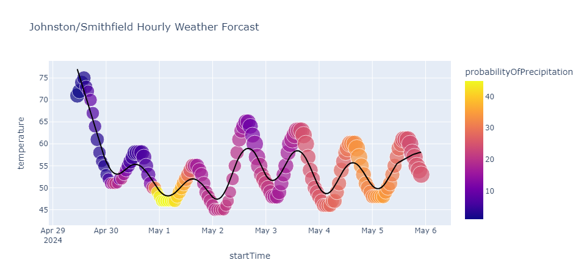

# Local Weather Analysis with Pandas and Plotly

This repo demonstrates how to use the [National Weather Service](https://www.weather.gov/) API along with pandas and plotly to do some visual weather forcast analysis.

## Sample Generated Local Weather Plot for Johnston RI

